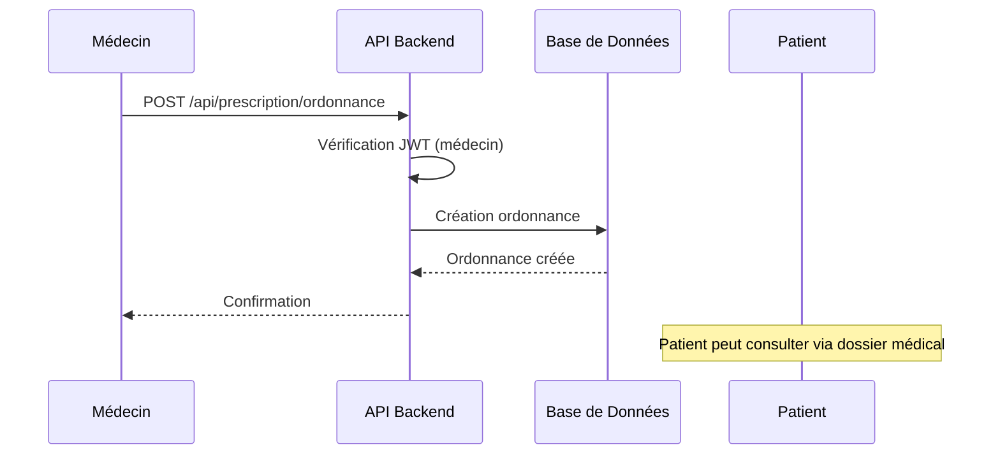
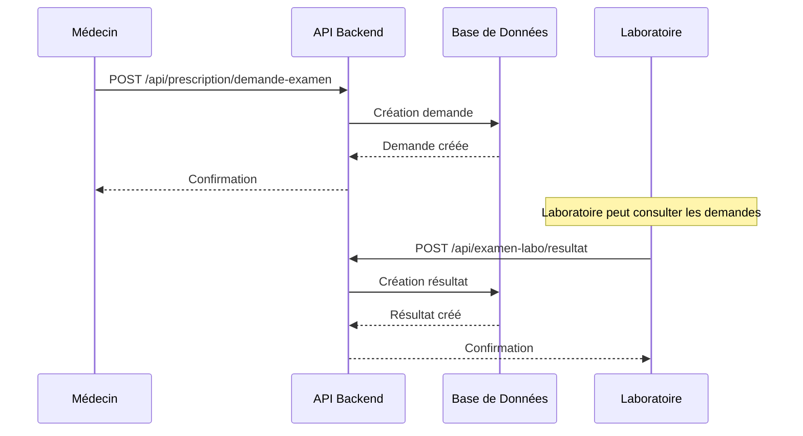
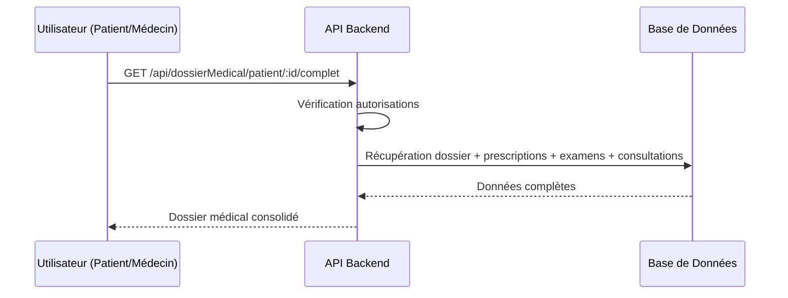

# Structure API pour le Partage Patient-Médecin

## Vue d'ensemble

Cette documentation explique comment la structure API actuelle gère le partage d'informations entre patients et médecins, en mettant l'accent sur les ordonnances, demandes d'examen, résultats d'examen et suivi médical.

## Architecture des Modules

### 1. Module `prescription` - Gestion des Ordonnances et Demandes d'Examen

**Endpoints principaux :**
- `POST /api/prescription/ordonnance` - Créer une nouvelle ordonnance
- `POST /api/prescription/demande-examen` - Créer une demande d'examen
- `GET /api/prescription/patient/:patient_id` - Récupérer les prescriptions d'un patient
- `GET /api/prescription/:id` - Récupérer une prescription spécifique
- `PUT /api/prescription/:id` - Mettre à jour une prescription
- `PATCH /api/prescription/:id/renouveler` - Renouveler une prescription
- `PATCH /api/prescription/:id/suspendre` - Suspendre une prescription

**Fonctionnalités clés :**
- Distinction entre ordonnances de traitement (`prescrit_traitement: true`) et demandes d'examen (`prescrit_traitement: false`)
- Gestion des statuts : `active`, `suspendue`, `terminee`, `annulee`, `en_attente`
- Système de renouvellement avec compteurs
- Association automatique avec le professionnel connecté via JWT

### 2. Module `examenLabo` - Gestion des Résultats d'Examen

**Endpoints principaux :**
- `POST /api/examen-labo/resultat` - Créer un nouveau résultat d'examen
- `GET /api/examen-labo/patient/:patient_id` - Récupérer les résultats d'un patient
- `GET /api/examen-labo/:id` - Récupérer un résultat spécifique
- `PUT /api/examen-labo/:id` - Mettre à jour un résultat
- `PATCH /api/examen-labo/:id/valider` - Valider un résultat
- `GET /api/examen-labo/en-attente` - Récupérer les résultats en attente de validation
- `GET /api/examen-labo/patient/:patient_id/statistiques` - Statistiques d'examens

**Fonctionnalités clés :**
- Gestion des statuts : `en_attente`, `valide`, `rejete`
- Classification des résultats : `normal`, `anormal`, `limite`
- Système de validation par les professionnels
- Statistiques et suivi des résultats anormaux

### 3. Module `dossierMedical` - Vue Consolidée

**Endpoints principaux :**
- `GET /api/dossierMedical/patient/:patient_id/complet` - Dossier médical complet
- `GET /api/dossierMedical/patient/:patient_id/resume` - Résumé des informations
- `GET /api/dossierMedical/:id` - Dossier médical par ID
- `POST /api/dossierMedical` - Créer un dossier médical
- `PUT /api/dossierMedical/:id` - Mettre à jour un dossier

**Fonctionnalités clés :**
- Agrégation de toutes les informations patient
- Inclusions automatiques : prescriptions actives, examens récents, consultations
- Gestion des autorisations granulaire
- Résumé statistique des activités médicales

### 4. Module `rendezVous` - Gestion des Rappels et Suivi

**Endpoints principaux :**
- `POST /api/rendez-vous/rappel` - Créer un rappel
- `GET /api/rendez-vous/patient/:patient_id/rappels` - Rappels d'un patient
- `GET /api/rendez-vous/patient/:patient_id/avenir` - Rendez-vous à venir
- `PATCH /api/rendez-vous/:id/annuler` - Annuler un rendez-vous
- `GET /api/rendez-vous/rappels/a-envoyer` - Rappels à envoyer (interne)

**Fonctionnalités clés :**
- Système de rappels avec différents types : `general`, `medicament`, `examen`, `consultation`
- Gestion des notifications et envoi
- Suivi des rendez-vous à venir
- Annulation avec motif

## Flux de Partage Patient-Médecin

### 1. Création d'Ordonnances



### 2. Demande d'Examen



### 3. Consultation du Dossier Complet



## Sécurité et Autorisations

### 1. Authentification JWT
- Tokens spécifiques pour patients et professionnels
- Récupération automatique de l'ID utilisateur depuis le token
- Vérification des rôles et permissions

### 2. Autorisations Granulaires
```javascript
// Exemple de vérification dans dossierMedical.controller.js
if (req.user.role === 'patient' && req.user.id_patient !== parseInt(patient_id)) {
    return res.status(403).json({ message: 'Accès non autorisé.' });
}
```

### 3. Validation des Données
- Validation côté serveur avec `express-validator`
- Vérification de l'existence des entités référencées
- Contrôle des types et formats de données

## Associations de Base de Données

### Modèle Prescription
```javascript
// Associations dans models/index.js
Prescription.belongsTo(Patient, { foreignKey: 'patient_id', as: 'patient' });
Prescription.belongsTo(ProfessionnelSante, { foreignKey: 'professionnel_id', as: 'redacteur' });
Prescription.belongsTo(DossierMedical, { foreignKey: 'dossier_id', as: 'dossier' });
```

### Modèle ExamenLabo
```javascript
ExamenLabo.belongsTo(Patient, { foreignKey: 'patient_id', as: 'patient' });
ExamenLabo.belongsTo(ProfessionnelSante, { foreignKey: 'professionnel_id', as: 'professionnel' });
ExamenLabo.belongsTo(DossierMedical, { foreignKey: 'dossier_id', as: 'dossier' });
```

## Endpoints de Partage

### Pour les Médecins
1. **Création d'ordonnances** : `POST /api/prescription/ordonnance`
2. **Demandes d'examen** : `POST /api/prescription/demande-examen`
3. **Consultation dossiers** : `GET /api/dossierMedical/patient/:id/complet`
4. **Gestion rappels** : `POST /api/rendez-vous/rappel`

### Pour les Patients
1. **Consultation prescriptions** : `GET /api/prescription/patient/:id`
2. **Consultation résultats** : `GET /api/examen-labo/patient/:id`
3. **Dossier complet** : `GET /api/dossierMedical/patient/:id/complet`
4. **Rendez-vous à venir** : `GET /api/rendez-vous/patient/:id/avenir`

### Pour les Laboratoires
1. **Création résultats** : `POST /api/examen-labo/resultat`
2. **Validation résultats** : `PATCH /api/examen-labo/:id/valider`
3. **Consultation demandes** : `GET /api/examen-labo/en-attente`

## Améliorations Futures

### 1. Notifications en Temps Réel
- Intégration WebSocket pour notifications instantanées
- Notifications push pour applications mobiles
- Emails/SMS automatiques pour rappels

### 2. Système de Messagerie
- Messages directs patient-médecin
- Historique des échanges
- Notifications de nouveaux messages

### 3. Partage Externe
- Génération de PDF pour ordonnances
- Partage sécurisé avec autres établissements
- API publique pour applications tierces

### 4. Analytics et Rapports
- Statistiques d'utilisation
- Rapports de suivi
- Métriques de performance

## Conclusion

La structure API actuelle fournit une base solide pour le partage patient-médecin avec :

✅ **Modules complets** : prescription, examenLabo, dossierMedical, rendezVous
✅ **Sécurité robuste** : JWT, autorisations granulaires, validation
✅ **Associations correctes** : liens entre toutes les entités
✅ **Endpoints RESTful** : API cohérente et documentée
✅ **Gestion des statuts** : workflow complet pour chaque type de document

Cette architecture permet un partage sécurisé et efficace des informations médicales tout en respectant les contraintes de confidentialité et d'autorisation. 